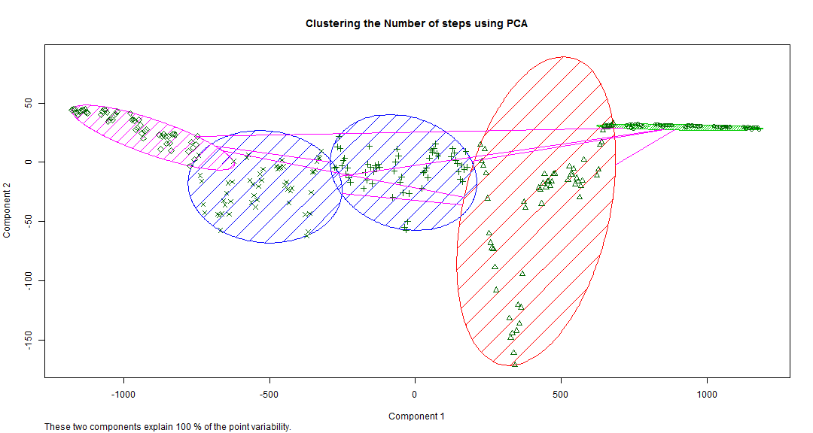

&nbsp; 

&nbsp;

#Activity Monitor Data Analysis - Preamble
&nbsp; 

##Purpose
Purpose of this document is to analyze in detail the outputs of an Activity Monitor. This device collects data at 5 minute intervals through out the day. The data consists of two months of data from an anonymous individual collected during the months of October and November, 2012 and include the number of steps taken in 5 minute intervals each day.
&nbsp; 

&nbsp; 

##Input Data Format
The data for this Analysis is available at the Link - [Activity Monitor Data][2]
The variables included in this dataset are:

 - **steps**: Number of steps taking in a 5-minute interval (missing values are coded as NA)

 - **date**: The date on which the measurement was taken in YYYY-MM-DD format

 - **interval**: Identifier for the 5-minute interval in which measurement was taken
&nbsp; 

&nbsp; 

##Technical Details
The Alogorith and Sourcecode for the below analysis is avaibale in the github **repo - [Link to Repo][1]** . 

-- **R Markdown File** - PA1_template.Rmd

-- **Markdown File** - PA1_template.md

-- **HTML Output** - PA1_template.html

-- **Input Data** - activity.zip. This .zip file contains the dataset in a comma-separated-value (CSV) file - "activity.csv" and there are a total of 17,568 observations in this dataset.
&nbsp; 

&nbsp; 

&nbsp; 

#Activity Monitor Data Analysis - Details
&nbsp; 

##Loading and preprocessing the data

The Data has been loaded from the URL into the loation **./activity_monitor/activity.csv**.

&nbsp; 

##Exploratory Analysis

This paper intends to identify patterns in data and answer some very specific questions, namely:

1. What is mean total number of steps taken per day?

2. What is the average daily activity pattern?

3. Are there differences in activity patterns between weekdays and weekends?

We also need to analyze the effects of keeping / removing NA values.

&nbsp; 

&nbsp;

**Plot#1 - Total number of Steps taken Per Day (keeping the NA values)**

-1.png) 

&nbsp; 

**Plot#2 - Total number of Steps taken Per Day (removing the NA values)**

-1.png) 
&nbsp; 

*Total Number of NAs replaced with appropriate values = 15264*
&nbsp; 

As is evident from these graphs, There is a no variation in the mean and a very negligible variation in the median of the number of steps taken per day after removal of the NAs.

**The Mean Total Number of Steps taken per day - **

- *After Removing NA = 10766.19*

- *Before Removing NA = 10766.19*

**The Median of Total Number of Steps taken per day - **

- *After Removing NA = 10766.19*

- *Before Removing NA = 10765*

The Algorithm used to remove the NAs is fairly straightforward. NAs are replaced by the mean of total number of steps aggregated for the specific interval. 
For Example, if we encounter and NA on a date 01/10/2012 and Interval = 5, then the mean of the total number of steps taken for the interval 5 for non-NA observations is calculated and assigned here.
&nbsp; 

*Another observation is the peaking of activities around 22-23 November (reasons to be established)*
&nbsp; 

&nbsp;

&nbsp;

**Plot#3 - Average Daily Activity Pattern**

 
&nbsp; 

**Some generic observations that can be made about the Activity Pattern based on intervals is that - **

- *There are several peaks and crests but the most predominant one is in the range of 800 - 900 or 8.00 AM to 9.00 AM*

- *The max activity is during the 5 minute interval of 835 (8.35 AM) where the average number of steps taken is 206.17*

- *There is an overall reduction of activities post 2000 or 8.00 PM*
&nbsp; 

The Algorithm used to remove the NAs is same as for the Histograms on total number of steps taken. NAs are replaced by mean of total number of steps aggregated for the specific interval. 
For Example, if we encounter and NA on a date 01/10/2012 and Interval = 5, then the mean of the total number of steps taken for the interval 5 for non-NA observations is calculated and assigned here.
&nbsp; 

&nbsp;

**Plot#4 - Differences in Activity Patterns between Weekdays and Weekends** 

 
&nbsp;

**There are some important variations to be noted in the activity patterns between weekdays and weekends:**

- *The mean activity over the weekdays (35.61) is lesser than the mean activity during the weekends (42.37)*

- *The activities over the weekends are more spread out with occassional peaks and valleys. But there is a stark peak of activities over the weekdays between 800 to 900 or in other words 8.00 AM to 9.00 AM*

- *Quite obviously the activities reduce in the later part of the day. But on weekends this reduction in activities is post 2000 or 8.00 PM whereas on weekdays it is a bit earlier at approax 1800 or 6.00 PM*

&nbsp; 

&nbsp; 

#Clustering the activities
&nbsp; 

Let us try to make use of the Principle Component Analysis technique to identify any sort of clustering or grouping that can be established.
&nbsp; 

 

| Interval | Steps |
|:--------:|:-----:|
|   728    | 68.51 |
|   1699   | 61.55 |
|   1228   | 43.67 |
|   2147   | 13.34 |
|   228    | 0.66  |

&nbsp; 

We can see that the highest activity intervals are centered around 8.00 AM (approx) followed by intervals centered around 5.00 PM (approx)
The Lowest activity interval is centered around 2.00 AM (approx).. probably the sleeping time

&nbsp; 

&nbsp; 

[1]: <https://github.com/nithsubr/RepData_PeerAssessment1> "Link to Repo" 
[2]: <https://d396qusza40orc.cloudfront.net/repdata%2Fdata%2Factivity.zip> "Activity Monitor Data"
